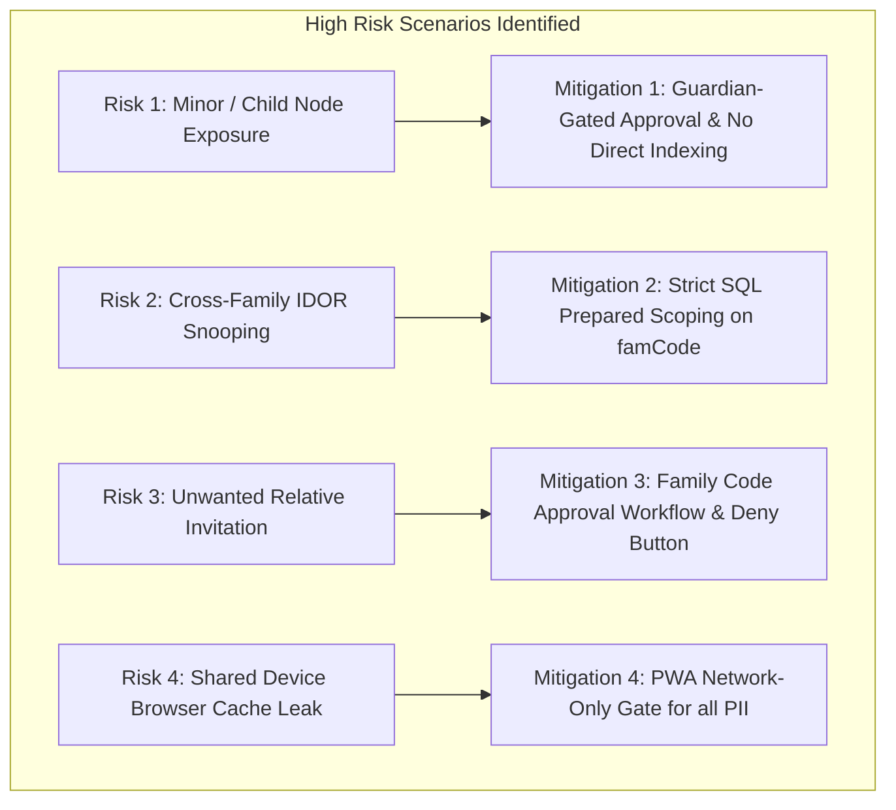

# 🏛️ DATA PROTECTION IMPACT ASSESSMENT (DPIA) — FAMILYPLATFORM
**System:** `FamilyPlatform` (Private Social Network, Living Organograms & Heritage Archives)  
**Lead Auditor:** Ajibike (AI Governance & Agentic Compliance Lead) & Marcus (SecOps)  
**Reviewed by:** David (Deloitte Principal Gatewatcher) & Olutobi (Head of TAT)  
**Classification:** High-Risk Processing Assessment (UK GDPR Article 35 / ICO Standard)  
**Date:** 13 September 2026  

---

## 1. Description of Processing

### 1.1 Nature and Scope
FamilyPlatform is a private family social network designed to preserve generational heritage, foster family connectivity, and celebrate milestones through:
- Interactive living family organograms (genealogy trees).
- Private family multimedia feeds (photos, memories, video stories).
- Nostalgia and milestone triggers ("On this day X years ago", birthdays, wedding anniversaries).
- Kinship suggestion engine connecting relatives via shared family codes (`famCode`) and node lineage.

### 1.2 Data Subjects & Volume
- Family members of all ages, including minors (children, nieces, nephews) whose profiles may be added by verified parents/guardians as lineage tree nodes.
- High volume of personal photos, historic dates, and kinship relationships.

---

## 2. Assessment of Necessity and Proportionality

| Principle | Implementation in FamilyPlatform | Proportionality Safeguard |
| :--- | :--- | :--- |
| **Lawfulness (Art. 6)** | Performance of service contract (Art. 6(1)(b)) and explicit consent for photo sharing (Art. 6(1)(a)). | Users retain 100% ownership of their uploaded photos and memories. |
| **Data Minimisation (Art. 5(1)(c))** | Telemetry and analytics collect only anonymized UX friction signals (rage clicks, dead clicks); zero keystroke logging, message text, or PII. | Telemetry IP addresses are masked at the subnet level (`192.168.1.0` / `/48` IPv6). |
| **Storage Limitation (Art. 5(1)(e))** | Expired reels and stories auto-deleted after 7 days (`REELS_EXPIRATION_DAYS=7`). | Deleted posts marked `date_deleted` and purged from public feeds instantly. |
| **PWA Cache Privacy** | Service worker caches static assets only. Authenticated API routes (`/api/memories`, `/api/onboarding`, `/api/claim-family-node`) are strictly **Network-Only**. | Prevents PII residue in unencrypted browser `CacheStorage` on shared family devices. |

---

## 3. Risk Identification & Mitigation Matrix

### Risk 1: Processing Data of Minors (Children & Young Relatives)
- **Inherent Risk:** High. Parents or grandparents may create family tree nodes for minor children with birthdates and photos.
- **Mitigation:**
  1. Minor nodes cannot register standalone accounts without explicit parental confirmation.
  2. Living organogram trees are walled behind authenticated family code boundaries (`postFamCode` / `famCode`), never indexed by search engines (`robots.txt: Disallow /`).
  3. Parents hold full unilateral rights to edit or remove child nodes at any time.
- **Residual Risk:** 🟢 **LOW / ACCEPTABLE**

### Risk 2: Cross-Family IDOR or Data Leakage
- **Inherent Risk:** Critical. Attackers attempting to snoop on private family moments or foreign family lineage.
- **Mitigation:**
  1. All database queries use strictly typed parameters with `WHERE postFamCode IN (...)` and `WHERE user_id = :auth_id`.
  2. Automated adversarial regression suites (`MemoryMilestoneSecurityTest.php`, `OnboardingSecurityTest.php`) enforce zero cross-family leaks in CI/CD.
- **Residual Risk:** 🟢 **NEGLIGIBLE**

### Risk 3: Malicious File Uploads (Photo / Video Exploits)
- **Inherent Risk:** High. Attackers attempting to upload weaponized SVG scripts or malware disguised as family photos.
- **Mitigation:**
  1. Strict server-side MIME verification using `finfo_file()` (not client file extensions).
  2. Cloudmersive Antivirus API scanning on all binary payloads.
  3. Stored with random UUID filenames and served with `X-Content-Type-Options: nosniff`.
- **Residual Risk:** 🟢 **NEGLIGIBLE**

---

## 4. DPO & Governance Sign-Off

- **Ajibike (Compliance Lead):** *"The DPIA confirms that the safeguards, automated testing suites, and PWA PII boundaries implemented in FamilyPlatform reduce privacy risks to an acceptable level under UK GDPR."*
- **Marcus (SecOps):** *"Adversarial testing confirms IDOR, CSRF, and XSS mitigations are active and enforced."*
- **Olutobi (TAT Chair):** *"Approved for production governance under UK GDPR Article 35."*
